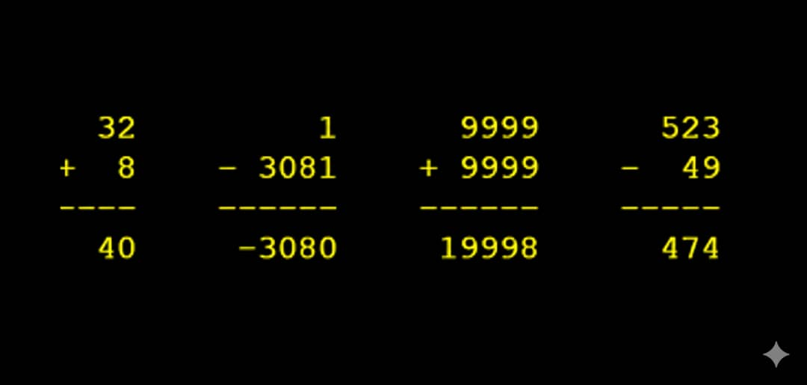
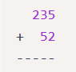
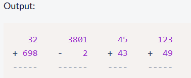
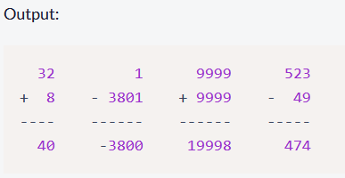

Proyecto del curso [Scientific Computing with Python](https://www.freecodecamp.org/learn/scientific-computing-with-python) de la plataforma [FreeCodeCamp](https://www.freecodecamp.org/)

<div align="center">
  <h3>Formateador Aritmético</h3>
  
</div>

# Build an Arithmetic Formatter

Students in primary school often arrange arithmetic problems vertically to make them easier to solve. For example, "235 + 52" becomes:




Finish the arithmetic_arranger function that receives a list of strings which are arithmetic problems, and returns the problems arranged vertically and side-by-side. The function should optionally take a second argument. When the second argument is set to True, the answers should be displayed.
Example

## Function Call:

arithmetic_arranger(["32 + 698", "3801 - 2", "45 + 43", "123 + 49"])



## Function Call:

arithmetic_arranger(["32 + 8", "1 - 3801", "9999 + 9999", "523 - 49"], True)



## Rules

The function will return the correct conversion if the supplied problems are properly formatted, otherwise, it will return a string that describes an error that is meaningful to the user.

### Situations that will return an error:
1. If there are too many problems supplied to the function. The limit is five, anything more will return: 'Error: Too many problems.'
2. The appropriate operators the function will accept are addition and subtraction. Multiplication and division will return an error. Other operators not mentioned in this bullet point will not need to be tested. The error returned will be: "Error: Operator must be '+' or '-'."
3. Each number (operand) should only contain digits. Otherwise, the function will return: 'Error: Numbers must only contain digits.'
4. Each operand (aka number on each side of the operator) has a max of four digits in width. Otherwise, the error string returned will be: 'Error: Numbers cannot be more than four digits.'
### If the user supplied the correct format of problems, the conversion you return will follow these rules:
1. There should be a single space between the operator and the longest of the two operands, the operator will be on the same line as the second operand, both operands will be in the same order as provided (the first will be the top one and the second will be the bottom).
2. Numbers should be right-aligned.
3. There should be four spaces between each problem.
4. There should be dashes at the bottom of each problem. The dashes should run along the entire length of each problem individually. (The example above shows what this should look like.)

## La función Python

    ```python:

    def formateador_aritmético(problemas, respuesta=False):

    # Contamos el numero de elementos en la lista
    if len(problemas) > 5:
        return "Error: Demasiados elementos."
    
    # Identificamos los elementos de la operación
    OperandoLista1 = []
    OperadorLista = []
    OperandoLista2 = []
    ResultadoLista = []
    
    for problema in problemas:
        componentes = problema.split()
        
        if len(componentes) != 3:
            return "Error: Un problema tiene dos operandos (A y B) y un operador (+ o -), es decir A + B"
        
        Operando1, Operador, Operando2 = componentes
        
        if Operador not in ['+', '-']:
            return "Error: El Operador debe ser suma (+) o resta (-)"
        
        if not Operando1.isdigit() or not Operando2.isdigit():
            return "Error: Deben ser numericos"
        
        if len(Operando1) > 4 or len(Operando2) > 4:
            return "Error: La longitud del numero no debe superara de 4 digitos"
        
        # Calculamos los resultados
        if respuesta:
            if Operador == '+':
                Valor = str(int(Operando1) + int(Operando2))
            else:
                Valor = str(int(Operando1) - int(Operando2))
        else:
            Valor = None
        
        # Guardamos en una lista los componentes
        OperandoLista1.append(Operando1)
        OperadorLista.append(Operador)
        OperandoLista2.append(Operando2)
        ResultadoLista.append(Valor)
    
    # Preparamos la salida
    Linea1 = []
    Linea2 = []
    TrazoLinea = []
    LineaResultado = []
    
    # Formateamos
    for i in range(len(problemas)):
        # Calculamos el ancho
        max_width = max(len(OperandoLista1[i]), len(OperandoLista2[i])) + 2
        
        # Primer Operando
        Linea1.append(OperandoLista1[i].rjust(max_width))
        
        # Operador  y Segundo Operanando
        Linea2.append(OperadorLista[i] + " " + OperandoLista2[i].rjust(max_width - 2))
        
        # Trazado de la Linea
        TrazoLinea.append('-' * max_width)
        
        #  El Resultado
        if respuesta and ResultadoLista[i] is not None:
            LineaResultado.append(ResultadoLista[i].rjust(max_width))
    
    problema_formateado = "    ".join(Linea1) + "\n"
    problema_formateado += "    ".join(Linea2) + "\n"
    problema_formateado += "    ".join(TrazoLinea)
    
    # Agregamos el resultado si es solicitado
    if respuesta:
        problema_formateado += "\n" + "    ".join(LineaResultado)
    
    return problema_formateado
    
    ```


 ## El Autor

| [<br><sub>Jesus H. Parra B.</sub>](https://github.com/ing-jhparra)
| :---: |

